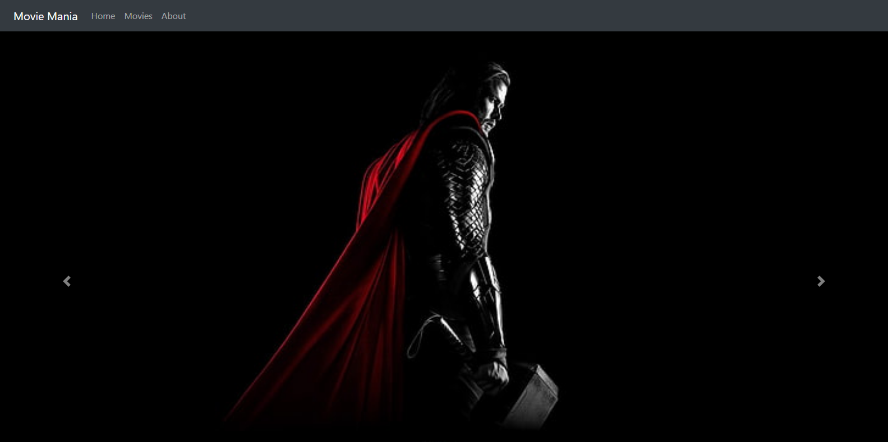
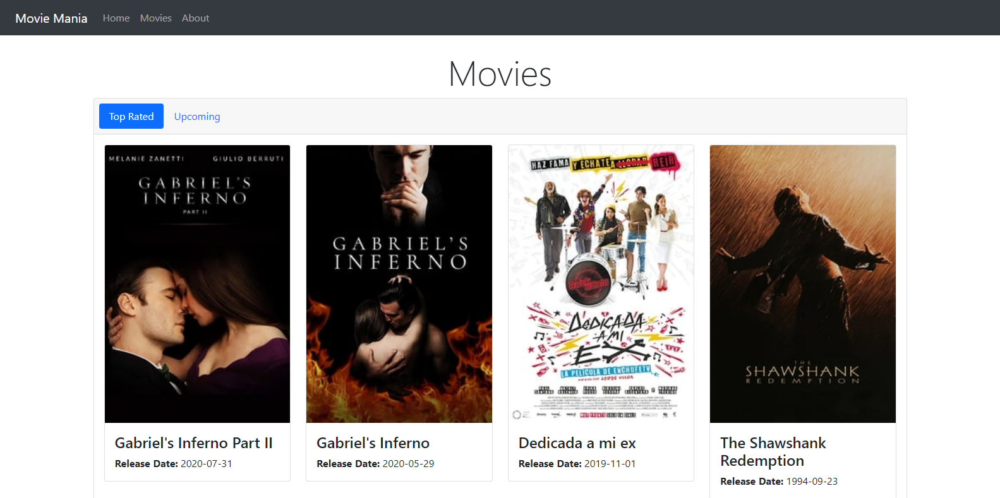
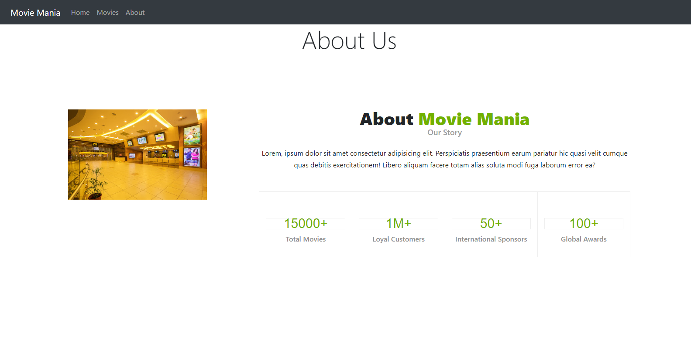

# Movie Mania

## Home Page



## Movies Page



## About Us Page



## Project Description

### Overview

<p>This project is built using <a href="https://developers.themoviedb.org/3" target="_blank">TMDB API</a>. This repository consist of 3 route pages, (i) Home Page, (ii) Movies Page and (iii) About Us Page. Home Page and About Us Page are static HTML page, whereas Movie Page consumes 2 API(s). One is <a href="https://developers.themoviedb.org/3/movies/get-top-rated-movies" target="_blank">Top Rated Movies API</a> and another is <a href="https://developers.themoviedb.org/3/movies/get-upcoming" target="_blank">Upcoming Movies API</a>. Each api is integrated with <b>Lazy Loading</b> feature integration, where data is loaded in paginated format.</p>

### API Documentation Link

- <a href="https://developers.themoviedb.org/3" target="_blank">Base Link</a>

- <a href="https://developers.themoviedb.org/3/movies/get-top-rated-movies" target="_blank">Top Rated Movies</a>

- <a href="https://developers.themoviedb.org/3/movies/get-upcoming" target="_blank">Upcoming Movies</a>

## Project setup

```
npm install
```

### Compiles and hot-reloads for development

```
npm run serve
```

### Compiles and minifies for production

```
npm run build
```

### Lints and fixes files

```
npm run lint
```

### Customize configuration

See [Configuration Reference](https://cli.vuejs.org/config/).
